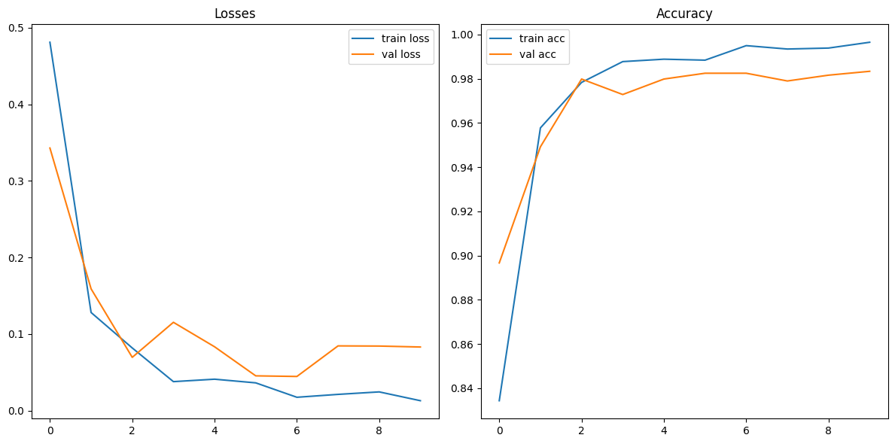
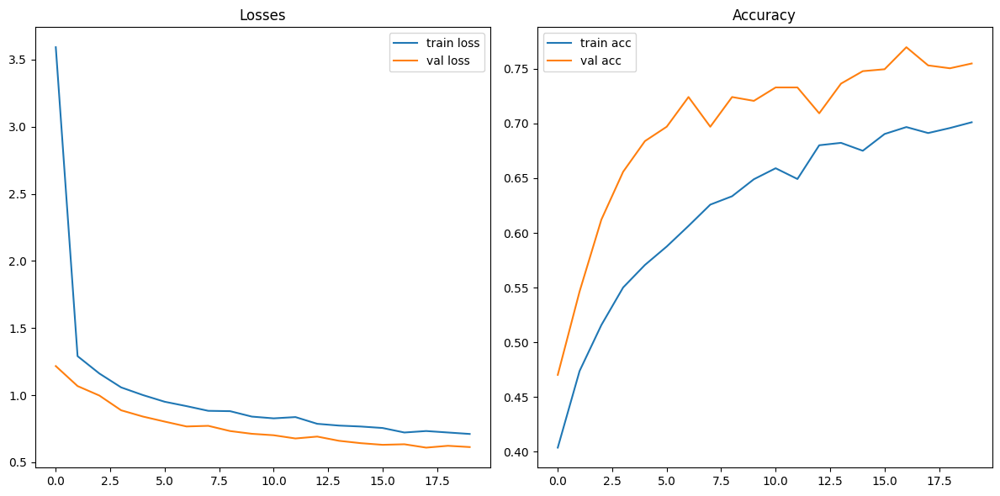
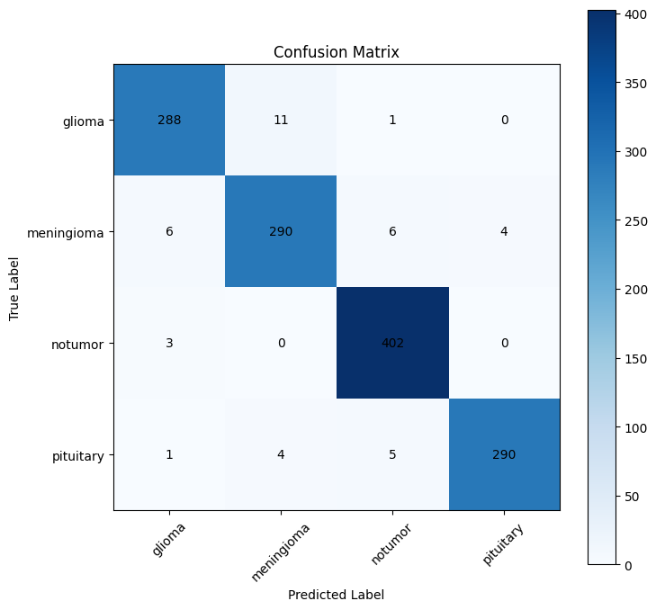

# Brain Tumor Detection with Machine Learning

## Table of Contents
1. [Problem Statement](#problem-statement)
2. [Project Goal](#project-goal)
3. [Evaluation Metric](#evaluation-metric)
4. [Dataset Description and EDA](#dataset-description-and-eda)
5. [Model Training](#model-training)
6. [Results](#results)
7. [Tools Used](#tools-used)
8. [Team Members](#team-members)

## Problem Statement
The detection of brain tumors through visual segmentation of MRI images, focusing on three major types: glioma, meningioma, and pituitary tumors. The goal is to develop an efficient model to classify these tumor types accurately.

## Project Goal
To develop a machine learning model that accurately classifies MRI images of brain tumors into glioma, meningioma, pituitary, and no tumor, with high precision and recall.

## Evaluation Metric
The primary evaluation metrics used for this project are:
- Accuracy
- Precision
- Recall
- F1 Score

## Dataset Description and EDA
The dataset consists of approximately 5000 training images and 1300 test images, categorized into four classes:
- Glioma
- Meningioma
- Pituitary
- No tumor

## Overview

|              | **Meningioma**                                                               | **Glioma**                                                                                           | **Pituitary**                                |
|--------------|-----------------------------------------------------------------------------|------------------------------------------------------------------------------------------------------|----------------------------------------------|
| **Location** | Protective membrane (outside the brain)                                     | Glial cells (inside the brain)                                                                       | Pituitary gland (base of the brain, one location) |
| **B/M**      | Benign                                                                      | Somewhat benign or malignant                                                                         | Mostly benign, rarely malignant              |
| **Priority** | Meningiomas are difficult to distinguish from other cancer types due to colocation, lowest priority | Includes GBM, an aggressive, high-grade malignant (aka brain cancer), highest priority for precision and recall (sensitivity) | Easy to detect due to known location, low priority |

EDA (Exploratory Data Analysis) included visualizing the distribution of images across classes and augmenting the data through techniques like flipping and rotation to improve model performance.

## Model Training
### Baseline Models
- **CNN Models:** Started with a simple CNN model and gradually increased the number and depth of layers, observing performance improvements. The best baseline model is **CNN_3LayerDeeper_Conv2D**.
  - Model Structure:
    ```python
    model = tf.keras.Sequential([
        tf.keras.layers.experimental.preprocessing.Rescaling(1./255),
        tf.keras.layers.Conv2D(64, 3, activation='relu'),
        tf.keras.layers.MaxPooling2D(),
        tf.keras.layers.Conv2D(64, 3, activation='relu'),
        tf.keras.layers.MaxPooling2D(),
        tf.keras.layers.Conv2D(64, 3, activation='relu'),
        tf.keras.layers.MaxPooling2D(),
        tf.keras.layers.Flatten(),
        tf.keras.layers.Dense(128, activation='relu'),
        tf.keras.layers.Dense(4)
    ])
    ```
- **DNN Models:** Explored basic DNN models to compare with CNNs.

### Advanced Models
- **Xception + DNN:** Combined the Xception architecture with DNN for better performance, leveraging transfer learning.
- **Transfer Learning:** Utilized pretrained models like ResNet50 and VGG16, fine-tuned for our specific dataset.

## Results
- **Baseline CNN Models:**
  - Performance improved by increasing layers and depth.
  - Best results with a 3-layer deeper CNN model.
- **Data Augmentation:**
  - Flipping images left and right significantly improved recall and F1 score.
- **Xception + DNN Model:**
  - Fine-tuning all layers led to a 4.5% performance boost.
  - Achieved the highest accuracy and recall, making it suitable for production use.


### Training and Validation Loss for Xception Model


### Training and Validation Accuracy for Xception Model



### Recall
| Model                              | Recall |
|------------------------------------|--------|
| XCEPTION_UNFROZEN_ALL              | 0.9909 |
| CNN_3LD_Flip_LeftRight             | 0.9649 |
| CNN_3LD_Flip_LEFTRIGHT_BRIGHTNESS_0.05 | 0.9639 |
| CNN_3LayerDeeper_Conv2D            | 0.9608 |
| CNN_3LD_Flip_LEFTRIGHT_ROT8        | 0.9549 |

### F1 Weighted
| Model                              | F1 Weighted |
|------------------------------------|-------------|
| XCEPTION_UNFROZEN_ALL              | 0.9909      |
| CNN_3LD_Flip_LeftRight             | 0.9649      |
| CNN_3LD_Flip_LEFTRIGHT_BRIGHTNESS_0.05 | 0.9639      |
| CNN_3LayerDeeper_Conv2D            | 0.9608      |
| CNN_3LD_Flip_LEFTRIGHT_ROT8        | 0.9549      |

### Confusion matrix
| Base CNN Model | Xception Model |
|------------|----------------|
|  |  |

### Improvement over detection of meningioma and glioma

The confusion matrices compare the performance of the base model and Xception model:

- **Glioma:** Xception improves correct classifications (288 vs. 277) and reduces misclassifications.
- **Meningioma:** Slightly better performance with fewer misclassifications.
- **Notumor:** Both models perform similarly, with Xception slightly better.
- **Pituitary:** Xception improves correct classifications and reduces misclassifications.

Overall, the Xception model shows better accuracy and fewer errors compared to the base model.

## Tools Used
- TensorFlow 🌟
- Keras 🌟
- Pandas 🐼: Data manipulation and analysis
- NumPy 🔢: Numerical computing
- Matplotlib 📊: Plotting and visualization
- Scikit-learn 📘: Machine learning library for Python, used for building and evaluating models

## Team Members
- **Kunal Sharma** [LinkedIn](https://www.linkedin.com/in/drkunalsharma/)
- **Roel D’Haese** [LinkedIn](https://www.linkedin.com/in/roel-d-haese-5390862b6/)
- **Stephan Krushev** [LinkedIn](https://www.linkedin.com/in/stephankrushev/)

---

Feel free to reach out for any questions or further information!
